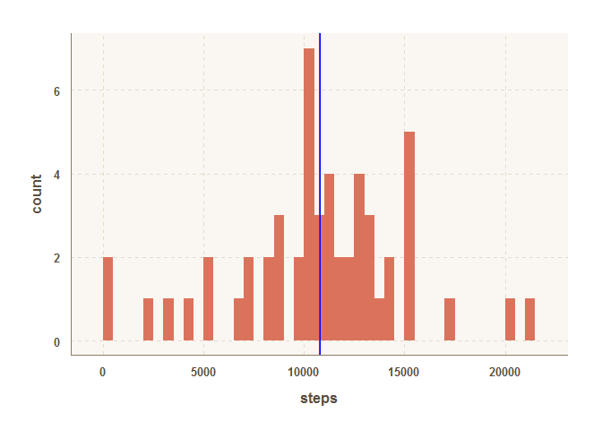
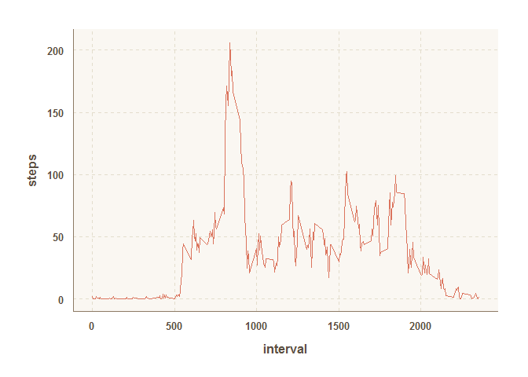
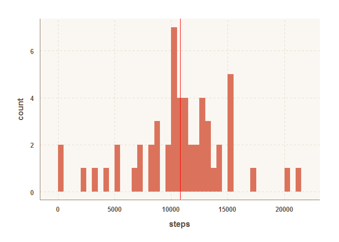
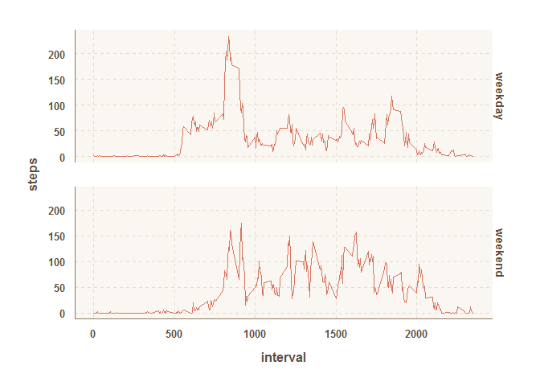

# Reproducible Research: Peer Assessment 1
Jakob Ludewig  
June 6th, 2015  


## Loading and preprocessing the data

We unzip and load in the raw activity data using the following R command:


```r
unzip("activity.zip")
activity.raw <- read.csv("activity.csv")
```

Looking at a summary of the data we can see that there a lot of missing values for the _steps_ variable which we will address at a later point.


```r
summary(activity.raw)
```

```
##      steps                date          interval     
##  Min.   :  0.00   2012-10-01:  288   Min.   :   0.0  
##  1st Qu.:  0.00   2012-10-02:  288   1st Qu.: 588.8  
##  Median :  0.00   2012-10-03:  288   Median :1177.5  
##  Mean   : 37.38   2012-10-04:  288   Mean   :1177.5  
##  3rd Qu.: 12.00   2012-10-05:  288   3rd Qu.:1766.2  
##  Max.   :806.00   2012-10-06:  288   Max.   :2355.0  
##  NA's   :2304     (Other)   :15840
```


From an inspection of the variable types using the R function _str_ we can see that the _date_ column was imported as a factor variable. We transform it to a date variable which will make plotting and further analyses easier.


```r
library(plyr)
str(activity.raw)
```

```
## 'data.frame':	17568 obs. of  3 variables:
##  $ steps   : int  NA NA NA NA NA NA NA NA NA NA ...
##  $ date    : Factor w/ 61 levels "2012-10-01","2012-10-02",..: 1 1 1 1 1 1 1 1 1 1 ...
##  $ interval: int  0 5 10 15 20 25 30 35 40 45 ...
```

```r
activity <- mutate(activity.raw,date= as.Date(date))
```

We will continue to work with the transformed _activity_ data frame.

## What is mean total number of steps taken per day?

We aggregate the total number of steps per day using


```r
steps.per.day <- aggregate(steps ~ date,data=activity,sum)
```

We calculate the mean and median of the total steps per day and store them in a data frame for plotting later:


```r
steps.stats <- data.frame(stat=c("mean","median"),value=c(mean(steps.per.day[,2]),median(steps.per.day[,2])))
steps.stats
```

```
##     stat    value
## 1   mean 10766.19
## 2 median 10765.00
```

A histogram plot is used to visualize the distribution of the steps taken each day. Meand and median of the steps per day were added but are too close to each other to be clearly distinguishable in the plot:


```r
library(ggplot2)
library(ggthemr)
```

```
## Loading required package: grid
```

```r
ggthemr('dust')
ggplot(steps.per.day) + geom_histogram(aes(x=steps),binwidth=500) + geom_vline(data=steps.stats[1,],aes(xintercept = value),colour="blue") + geom_vline(data=steps.stats[2,],aes(xintercept = value),colour="red")
```

 

## What is the average daily activity pattern?

We calculate the steps taken per five minute interval using the _aggregate_ function again and make a time series plot using _ggplot2_:


```r
steps.per.interval <- aggregate(steps ~ interval,data=activity,mean)
ggplot(steps.per.interval) + geom_line(aes(x=interval,y=steps))
```

 

The interval containing the maximum number of average steps per interval is found using the following command:


```r
steps.per.interval[which.max(steps.per.interval$steps),]
```

```
##     interval    steps
## 104      835 206.1698
```

## Imputing missing values

To get the number of rows containing NA values we first compute the number of NA entries for each column:


```r
apply(activity,FUN = function(x) { sum(is.na(x))},2)
```

```
##    steps     date interval 
##     2304        0        0
```

As we can see the only column containing NA's is the _steps_ column so our total number of observations containing NA values is 2304.

Taking a closer look at the distribution of the missing values we can see that there is a series of 576 consecutive NA's:


```r
sum(is.na(activity[11233:11807,1]))
```

```
## [1] 575
```

Accordingly we would run into trouble if we were to replace the missing values with the corresponding day's average since we are missing at least one whole day of data.

Therefore we choose to replace the missing values by the steps taken in the corresponding interval averaged over each day:


```r
activity.impute <- activity
activity.impute[is.na(activity.impute[,1]),1] <- steps.per.interval[activity.impute[is.na(activity.impute[,1]),3] == steps.per.interval[,1],2]
```

We now calculate the mean and median for the imputed set of data:


```r
steps.per.day.impute <- aggregate(steps ~ date,data=activity.impute,sum)
steps.stats.impute <- data.frame(stat=c("mean","median"),value=c(mean(steps.per.day.impute[,2]),median(steps.per.day.impute[,2])))
steps.stats.impute
```

```
##     stat    value
## 1   mean 10766.19
## 2 median 10765.59
```

The mean is exactly the same as for the set containing missing values. The median is slightly different.

Finally we plot the histogram for the new data:


```r
ggplot(steps.per.day.impute) + geom_histogram(aes(x=steps),binwidth=500) + geom_vline(data=steps.stats.impute[1,],aes(xintercept = value),colour="blue") + geom_vline(data=steps.stats.impute[2,],aes(xintercept = value),colour="red")
```

 

## Are there differences in activity patterns between weekdays and weekends?

As the last part of this assignment we explore whether the movement patterns differ between weekdays and weekends. In order to do so we add a new variable to the data frame to contain the weekdays for each day:


```r
# we have to set the locale to get english weekdays
Sys.setlocale("LC_TIME", "English")
```

```
## [1] "English_United States.1252"
```

```r
activity.impute$weekdays <- weekdays(activity.impute$date)
```

We need two new data frames containing the steps taken for each interval for weekends and weekdays respectively:


```r
isweekend <- activity.impute$weekdays %in% c("Saturday","Sunday")
activity.impute.weekend <- activity.impute[isweekend,]
activity.impute.weekdays <- activity.impute[!isweekend,]
steps.per.interval.weekdays <- aggregate(steps ~ interval,data=activity.impute.weekdays,mean)
steps.per.interval.weekdays$weekdays = "weekday"
steps.per.interval.weekend <- aggregate(steps ~ interval,data=activity.impute.weekend,mean)
steps.per.interval.weekend$weekdays = "weekend"
steps.per.interval.combined <- rbind(steps.per.interval.weekend,steps.per.interval.weekdays)
```

With these two data frames we can produce the panel plot:


```r
qplot(interval,steps,data=steps.per.interval.combined,facets=weekdays ~.,geom = "line")
```

 

On weekdays there seems to be less movement activity in the middle of the day and the (intervals 1000 through 1500) compared to those on the weekends. Also the later intervals of the day (2000 and later) are somewhat less active than on weekends. On the other hand the intervals 500 through approximately 900 show much higher step counts than the corresponding weekend intervals.
